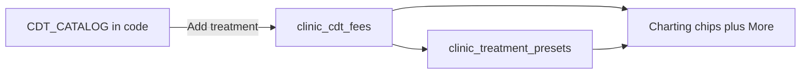

# Clinic menu + chairside pick (Settings & Charting)

Date: 2026-09-05

## Goal

Keep the current patient chairside page (`/admin/patients/[patientKey]`) — chart left, tap-to-add planner right. Make that loop as simple as a dentist needs: set prices once in Settings, then tap a tooth and a **name** (Fill, Crown, Extract). Fees come from Supabase. No typing codes or prices chairside (rare tap-to-edit on one row is allowed).

## Simplicity (this page)

Match Nour Farid’s chairside screen. Do not add new chrome.

- **Same layout:** chart + Immediate / Planned lists + fee estimate + Book. No new drawers or tabs.
- **Names, not codes:** chips and rows show `Extract`, not `D7140`. CDT stays in the database only.
- **More = more chips:** extra menu items use the same 2-column buttons as Fill / Crown / Root canal / Extract. No grouped sheet.
- **Settings matches those chips:** 4 favorite slots on top, then a flat name + EGP list. Groups exist only inside the Add dropdown so a long pick-list is scannable.

## Decisions (approved)

| Topic | Choice |
| --- | --- |
| Scope | Settings clinic menu **and** Charting tap-to-add |
| Chairside picker | 4 favorite chips + **More treatments** (rest of the menu) |
| Per-visit fee | Settings price by default; tap the amount to change this one row |
| Catalog growth | Pick extra procedures from a bigger in-app CDT list; set the price |
| Data | Catalog (names, groups, short labels) stays in code; Supabase stores the clinic menu + 4 favorites |
| Settings layout | Favorites on top (4 slots), then a flat name + EGP list + Add |
| Settings save | Each change persists immediately (no bottom Save) |
| Site settings | Unchanged |

## Non-goals

- Full ADA CDT book
- Procedure names/groups as Supabase rows
- Custom typed treatment names
- Changing Site brand settings
- Insurance EDI / per-line insurance
- Rewriting History / Clinical / the old `TreatmentEditorForm`
- New shared primitives under `src/components/ui/`
- PaginatedTable (menu is a small clinic list)

## Dentist loop

### Settings → Charting fees (clinic prices)

1. Tap **Add treatment**, pick a name from a grouped list (Fillings, Crowns, Root canal, …).
2. Type the EGP amount on that row (the only typing).
3. Assign 4 chairside favorites by picking from the clinic menu. Labels fill in as `+ {shortLabel}`.

Primary label is the short name. Do not show CDT codes in Settings either.

### Charting (patient) — keep this URL’s UI

1. Tap a tooth (existing prompt until then).
2. Tap a favorite chip, or tap **More** to reveal extra chips in the **same grid**, then tap one.
3. The procedure is added at the Settings fee. The row title is the short name (`Extract`), tooth + fee stay as today.
4. If this visit needs a different price, tap the amount on that row (`CdtFeeField` stays).

Leave Immediate / Planned, insurance rate chips, Book, Export, and Send estimate as they are.

## Data

### In code — expanded `CDT_CATALOG`

Each entry: `code`, `title`, `shortLabel`, `group`, `defaultPhase`.

Groups (UI labels): Exam & emergency, Fillings, Root canal, Extraction, Crowns, Gum / cleaning, Implants & dentures, Other.

Curated list (~34 codes), including today’s 20 plus common extras:

- Exam: D0120 Checkup, D0140 Problem exam, D0150 Full exam, D9110 Pain relief
- Fillings: D2330–D2332, D2391–D2394 (short labels like Fill, Fill (2 surfaces))
- Endo: D3220 Pulpotomy, D3310–D3330 Root canal (front / premolar / molar)
- Extract: D7140 Extract, D7210 Surgical extract, D7220 / D7230 Impacted, D7510 Drain abscess
- Crowns: D2740 Crown, D2750 Crown (PFM), D2950 Core buildup, D2954 Post & core
- Perio: D1110 Cleaning, D4341 Scaling
- Implant / denture: D6010 Implant, D6058 Implant crown, D6240 Bridge pontic, D5110 Full denture (upper), D5213 Partial denture
- Other: D9944 Night guard, D9972 Whitening

No `defaultFee` on catalog entries. Fees live only in Supabase.

### In Supabase (existing tables, no migration)

- `clinic_cdt_fees` — clinic menu. **Row exists = on the menu.** Add = upsert. Remove = delete (blocked if that code is a favorite; FK already enforces this).
- `clinic_treatment_presets` — 4 slots. `label` is auto-written from `+ {shortLabel}` when the dentist picks a code. They never type the label.

Today’s seed (~20 codes + 4 presets) stays the starting menu. New catalog codes appear only after Add.

### Charting reads

- 4 chips = `resolveChairsidePresets(presets, fees)` (already exists).
- More = menu rows whose code is **not** one of the 4 favorite codes.
- `cdtAddPayload` still writes `patient_treatments` with `cdt_code` + `fee_amount`.

## UI

### Settings

Replace the CDT fee table + typed chip labels. Keep it one short page.

- **Chairside favorites:** 4 cards that look like the patient chips. Each is a `<select>` of **menu** names. Label auto-saves as `+ {shortLabel}`.
- **Clinic menu:** flat rows — name, EGP input, remove. No group headings on the list.
- **Add treatment:** one `<select>` of catalog names not already on the menu (`optgroup` by type). Picking one upserts `fee_egp: 0`.
- Remove uses `ConfirmDeleteDialog`. If the code is a favorite, disable remove.
- No page-level Save button. Persist on add / fee blur / favorite change / confirmed remove. Toast via `sonner`.

### Charting

- Keep `CdtPresetChips` on this page. Add a **More** button that appends extra chips in the same 2-column grid (`CdtMoreTreatments` is not a separate sheet — fold into the chips component if it stays under ~100 lines).
- Empty More: “Add more treatments in Settings.”
- `CdtProcedureRow` title = short name from catalog, not `procedure.cdtCode`.
- `ProcedureBuilderDrawer` gets the same chips for free.
- `CdtFeeField`, lanes, estimator, and book actions stay.

## Errors and empty states

- Load failure: toast; fall back to today’s hardcoded 4 presets (`resolveChairsidePresets([], [])`).
- Save / delete failure: toast; leave draft unchanged.
- Cannot delete a favorite’s code: button disabled + short reason.
- Add picker empty: all catalog items are already on the menu.
- No tooth selected: existing dashed prompt; chips/More disabled.
- Fee input: whole EGP ≥ 0 (existing parse).

## Testing

Node tests (`yarn test` / `bash scripts/test.sh`):

- Catalog: unique `D####` codes, every row has `shortLabel` + `group`, still no `defaultFee`.
- `chipLabelFor(code)` → `+ Fill` for D2391.
- `addableCatalog(menuCodes)` omits codes already on the menu.
- `canRemoveFromMenu(code, presets)` is false when a slot uses that code.
- `moreMenuItems(menu, presets)` excludes the 4 favorite codes.
- Existing `resolveChairsidePresets` tests stay green.

## Files (targets)

Keep each TS/TSX file ~100 lines; named exports; no `any`.

- `src/services/cdt/types.ts` — `CdtGroup`, `shortLabel`, `group`
- `src/services/cdt/catalog.ts` — expanded catalog + `GROUP_LABELS` + `chipLabelFor`
- `src/services/cdt/menu.ts` — `addableCatalog`, `canRemoveFromMenu`, `moreMenuItems`, `resolveClinicMenu`
- `src/services/clinic_fees/mutations.ts` — `deleteClinicCdtFee`
- `src/features/admin/components/ChartingFees*` — menu UI, no Save button
- `src/features/admin/components/patients/charting/CdtPresetChips.tsx` — 4 chips + More in the same grid
- `src/features/admin/components/patients/charting/CdtProcedureRow.tsx` — name, not code
- `src/features/admin/components/patients/charting/useChairsidePresets.ts` — also return more items
